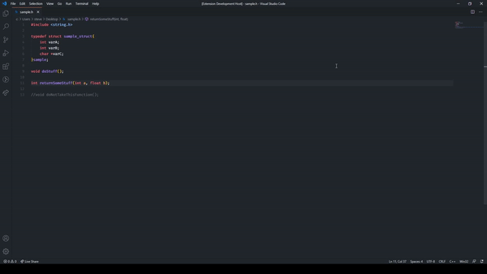
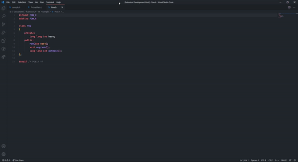
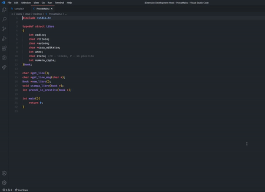
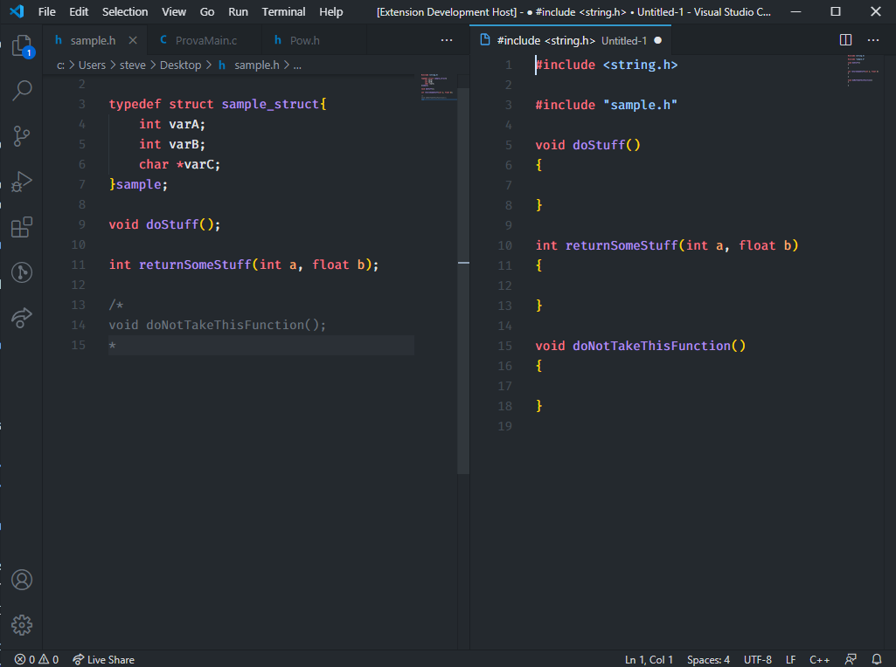
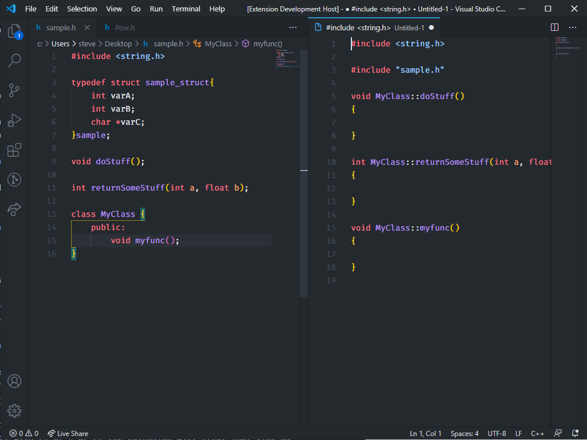

# Autocomplete C/C++ files

This extension will write the implementation of your C/C++ code without make you copy and paste like an idiot

## Features

the extension will generate the implementation file, if you run the command "write implementation file", or will generate the implementation for the functions at the end of the file, if you run the command "Parse main file"

## Usage
Open the command Palette (`ctrl` + `shift` + `P`) and select one of the following commands:

* `Wirte Implementation File`
* `Parse Main File`

### Write implementation file:
with a normal C header file

with a C++ header file that contains a class

> The command will read the header file and will print in a file that will prompt side by side the header file in the editor (see the column number setting in the settings).

### Parse main file:
whith the main file

> The command will read the focused file in the editor and will append the methods signatures at the end of the file.

## Extension Settings

this extension can be custimizabile with the some settings

For example:

* `autocomplete-c-cpp-files.indentStyle`: choose the indentation style between K&R (default) and Allman
* `autocomplete-c-cpp-files.columnNumber`: choose the column to open the implementation file, default is 2 (will open the file side by side the header file in the editor) 

## Known Issues

here is a list of all the known issues I am working on, if you find a new issue please report it [here](https://github.com/SteveSevetS/autocomplete-c-cpp-files/issues)

* if a line is a method signature but it is in a comment block and doesen't start with /* or * or // the extension will treat that line as a method signature

* if there is a class in the file the extension will implements the functions with ClassName::FunctionNAme with all of them

## Release Notes

### 1.0.0

Initial release of the extension!!!

-----------------------------------------------------------------------------------------------------------